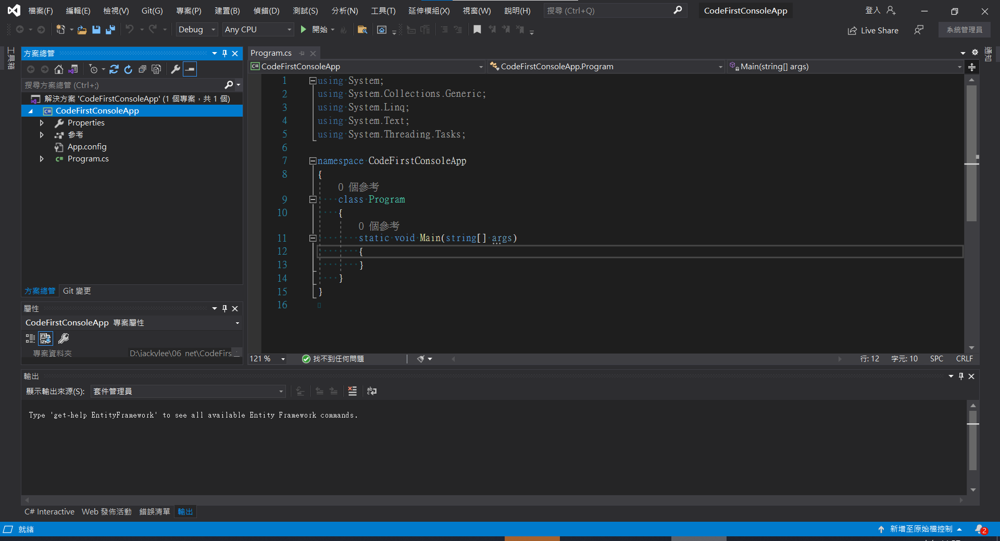
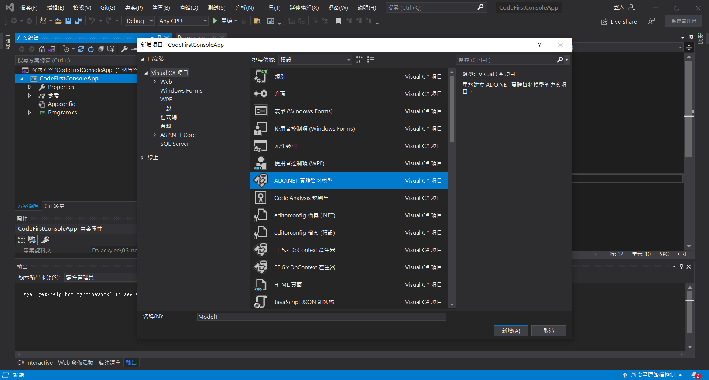
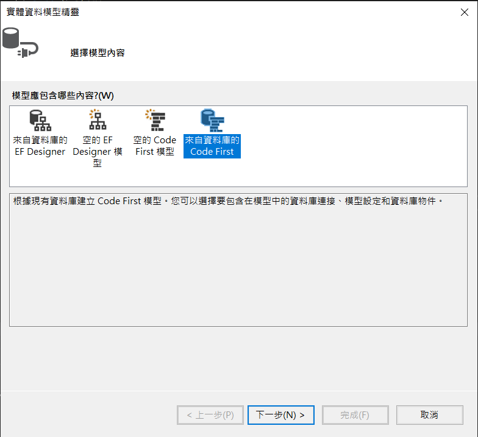
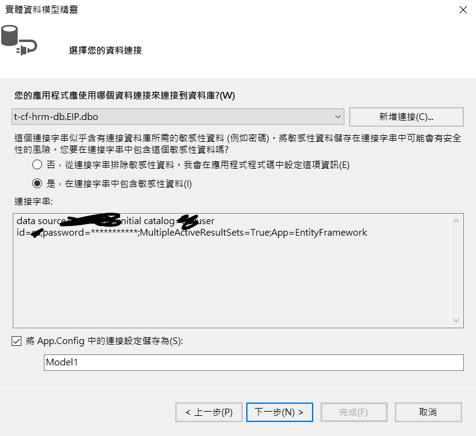
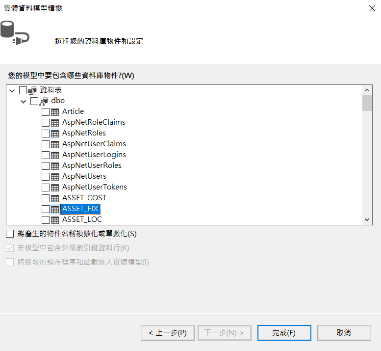
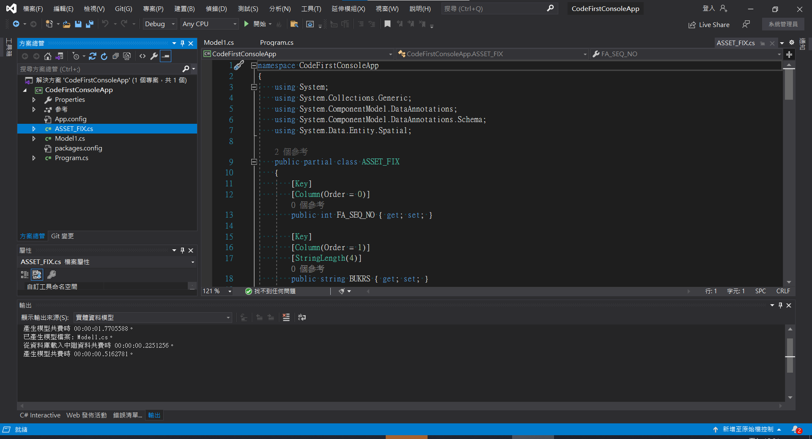

# Code-first-create-entity
Code first 產生實體模型，使用既有的DB

#### 開發環境
* Microsoft Visual Studio Professional 2019
* .Net Framework 4.7.2
***
#### 建立過程
新建立**主控台應用程式**

加入項目 ADO.NET Entity Data Model

選擇 Code first

輸入項目

<!---->

選擇Table

完成

